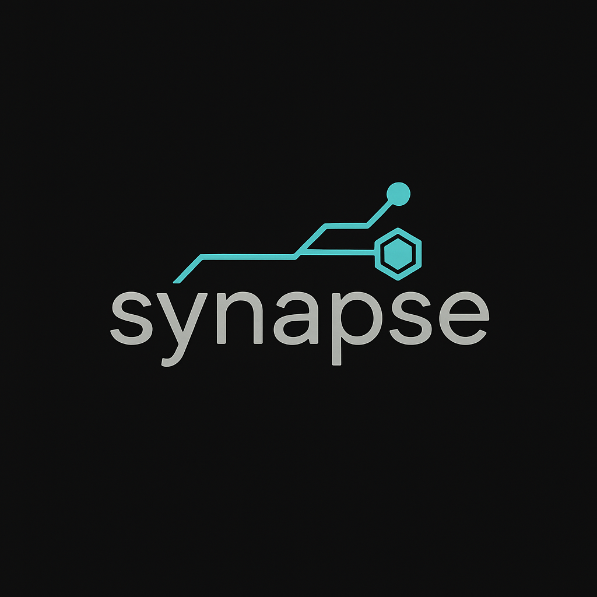

# Synapse: Your Brain, Upgraded.

<div align="center">
  
  
 *Your brain is full. Let's fix that.*
</div>

## What is this Glorious Contraption?

Is your browser buried under 1,000 tabs of "I'll read this later"? Is your notes app a digital graveyard of forgotten brilliance? Do you have more markdown files than memories?

Good. You're in the right place.

**Synapse** is a local-first, AI-powered second brain that *actually* remembers stuff for you. Feed it articles, meeting notes, code snippets, and your half-baked shower thoughts. Then, ask it questions in plain English. It doesn't just search—it understands, synthesizes, and gives you intelligent answers, complete with citations from... well, from *you*.

It's the ultimate "I told you so" machine, and you're telling yourself.

## The "Magic" (It's Not Magic, It's RAG)

1.  **You Feed the Beast:** Drop in any text document.
2.  **It Chews on It:** Synapse uses advanced models to chunk and create vector embeddings (think of them as "idea-fingerprints").
3.  **You Ask a Question:** "What were the security concerns from that one frontend report?"
4.  **It Thinks:** It finds the most relevant "idea-fingerprints," reads the original text, and uses a powerful local LLM to generate a human-like answer.
5.  **You Look Like a Genius:** You get a perfect summary, complete with links to the exact sources you fed it.

All of this happens **on your machine**. No cloud provider is reading your plans for world domination.

## The Bragging Rights (The Stack)

This isn't your weekend Flask project. This is a fully containerized, asynchronous, multi-database system built with a modern, ridiculously fast stack because waiting is for Luddites.

  * **🧠 Brains:** `Ollama` running your favorite local LLMs. Because who needs the cloud when you have a perfectly good space heater... I mean, GPU.
  * **🚀 Engine:** `FastAPI` + `Haystack` doing the heavy lifting. Asynchronous, performant, and probably over-engineered for a personal project. We love it.
  * **🎭 Face:** `Next.js 15` making everything look sharp and feel snappy.
  * **🗄️ Memory:** `SQLite` for the facts, `ChromaDB` for the vibes (and vectors).

Forged in the fires of late-night coding sessions and way too many build reports, this thing is hardened and ready.

## You Know You Want To (Quick Start)

Feeling brave? Want to run this glorious beast?

### Prerequisites

  * You know what `Python`, `Node.js`, and `Docker` are.
  * You have them installed.
  * You've installed [Ollama](https://ollama.ai/) and it's running.

### 🚀 The One-Command Wonder

Seriously, just one command.

```bash
make run-all
```

Wait for the Docker containers to spin up and the matrix to load.

### Access Points

  * **The Pretty Part (UI):** `http://localhost:8100`
  * **The Engine Room (API):** `http://localhost:8101`
  * **The Blueprints (API Docs):** `http://localhost:8101/docs`

## The Fine Print

### Configuration

Everything important is in the root `.env` file. You'll probably want to create one and set your own `API_KEY`. Don't worry, it doesn't leave your machine.

### The Roadmap

  * [ ] Make it even smarter.
  * [ ] Add voice input so you can talk to it.
  * [ ] Probably add more buttons.

-----

<div align="center"\>
<strong\>Synapse</strong\> - Remember everything.
</div\> 
