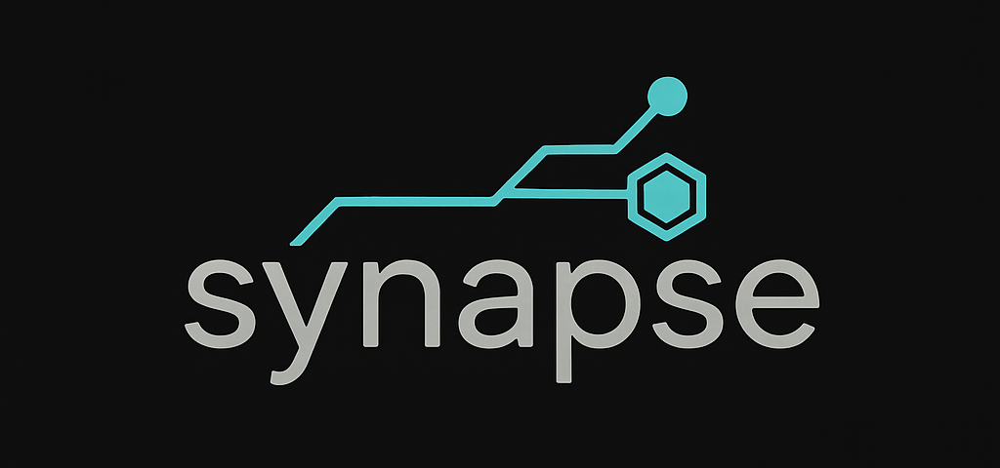

# Capture-v3: Your Knowledge, Captured.

<div align="center">
  
  
 *Your brain is full. Let's fix that.*
</div>

## What is this Glorious Contraption?

Is your browser buried under 1,000 tabs of "I'll read this later"? Is your notes app a digital graveyard of forgotten brilliance? Do you have more markdown files than memories?

Good. You're in the right place.

**Capture-v3** is a local-first, AI-powered knowledge management system that *actually* remembers stuff for you. Feed it articles, meeting notes, code snippets, and your half-baked shower thoughts. Then, ask it questions in plain English. It doesn't just search—it understands, synthesizes, and gives you intelligent answers, complete with citations from... well, from *you*.

It's the ultimate "I told you so" machine, and you're telling yourself.

## The "Magic" (It's Not Magic, It's RAG)

1.  **You Feed the Beast:** Drop in any text document.
2.  **It Chews on It:** Capture uses advanced models to chunk and create vector embeddings (think of them as "idea-fingerprints").
3.  **You Ask a Question:** "What were the security concerns from that one frontend report?"
4.  **It Thinks:** It finds the most relevant "idea-fingerprints," reads the original text, and uses a powerful local LLM to generate a human-like answer.
5.  **You Look Like a Genius:** You get a perfect summary, complete with links to the exact sources you fed it.

All of this happens **on your machine**. No cloud provider is reading your plans for world domination.

## The Bragging Rights (The Stack)

This isn't your weekend Flask project. This is a fully containerized, asynchronous, multi-database system built with a modern, ridiculously fast stack because waiting is for Luddites.

  * **🧠 Brains:** `Ollama` running your favorite local LLMs (currently `gemma3n:e4b`). Because who needs the cloud when you have a perfectly good space heater... I mean, GPU.
  * **🚀 Engine:** `FastAPI` + `Haystack 2.0` doing the heavy lifting. Asynchronous, performant, and probably over-engineered for a personal project. We love it.
  * **🎭 Face:** `Next.js 15` with dark mode that's easier on the eyes than your IDE's "Dracula" theme.
  * **🗄️ Memory:** `SQLite` for the facts, `ChromaDB` for the vibes (and vectors).
  * **🔒 Security:** XSS protection with DOMPurify because we don't trust AI responses (or you).

Forged in the fires of late-night coding sessions and way too many build reports, this thing is hardened and ready.

## You Know You Want To (Quick Start)

Feeling brave? Want to run this glorious beast?

### Prerequisites

  * **Python 3.11+** (for the backend wizardry)
  * **Node.js 18+** (for the frontend sparkle)
  * **Docker & Docker Compose** (for container orchestration)
  * **[Ollama](https://ollama.ai/)** (optional but recommended for local LLMs)
  * **curl** (you probably have this)

### 🚀 The One-Command Wonder

```bash
git clone https://github.com/yourusername/capture-v3.git
cd capture-v3
make init        # First time? Start here!
make dev         # Start everything in background
```

That's it. Seriously. The Makefile handles everything:
- ✅ Creates `.env` files with sensible defaults
- ✅ Installs all dependencies (Python & Node.js)
- ✅ Builds and starts Docker containers with health checks
- ✅ Waits for services to be ready before proceeding
- ✅ Launches the frontend in the background

### 🎯 Common Commands

```bash
make dev         # Start all services in background (recommended)
make status      # Check if everything is running
make logs        # View all logs
make stop-all    # Stop when done
make help        # Show all available commands
```

### 🔐 Security First

```bash
make security-check  # Run security audit
make run-prod       # Start with production settings
```

Wait for the Docker containers to spin up and the matrix to load. Pro tip: If you see ASCII art, you're doing it right.

### Access Points

  * **The Pretty Part (UI):** `http://localhost:8100`
  * **The Engine Room (API):** `http://localhost:8101`
  * **The Blueprints (API Docs):** `http://localhost:8101/docs`

## The Fine Print

### Configuration

Everything important is in the root `.env` file. The Makefile will create one for you with sensible defaults. Want to get fancy? Check out `.env.production.example` for hardened settings.

### 🧪 Advanced Features

```bash
make docs           # Comprehensive documentation
make backup-data    # Backup your knowledge
make restore-data   # Time travel your database
make run-debug      # Debug mode with network tools
make monitor        # Live dashboard (if you like watching numbers)
```

### 🐰 The Konami Code

If you're reading this far, you deserve a treat. Try this:

```bash
make troubleshoot
# When asked "What's the issue?", type: ↑↑↓↓←→←→BA
# Just kidding, that doesn't work. But wouldn't it be cool if it did?
# The real easter egg is that 'make help | grep -i coffee' might surprise you.
```

### The Roadmap

  * [x] ~~Make it work~~ ✅
  * [x] ~~Make it fast~~ ✅  
  * [x] ~~Make it pretty~~ ✅
  * [ ] Add voice input (Deepgram PoC already in!)
  * [ ] Make it predict what you're thinking
  * [ ] Achieve sentience (but like, the friendly kind)

### Known "Features"

  * The AI sometimes gets philosophical. We consider this a feature.
  * ChromaDB might use more RAM than Chrome. Ironic, we know.
  * If you feed it your diary, it might become too emotionally intelligent.

-----

<div align="center">

**Capture-v3** - Because your brain deserves a backup.

*Built with ☕ and too many late nights*

</div> 
