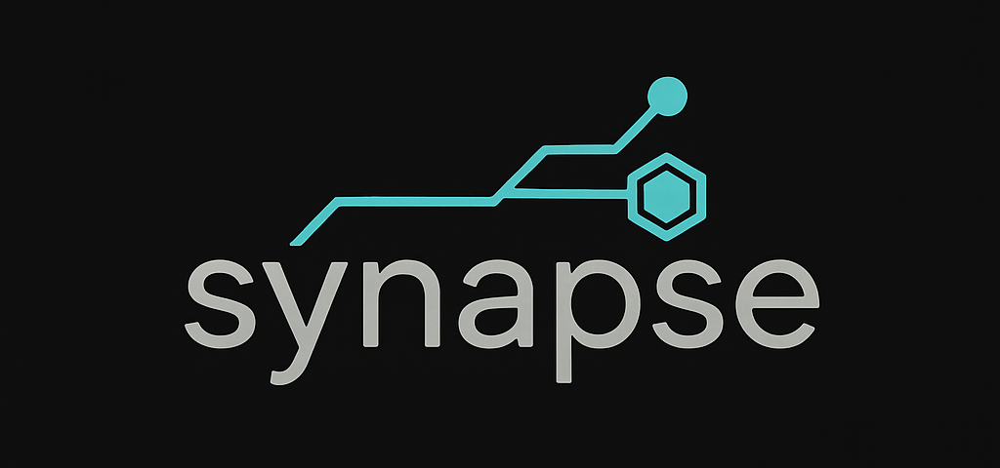

# Synapse: Your Knowledge, Captured.

<div align="center">
  
  
 *Your brain is full. Let's fix that.*
</div>

## Ever forget something?

Is your notes app a digital graveyard of forgotten brilliance?

Is your browser buried under 400 tabs of "Revisit this later" or do you bury those deeper into bookmark oblivion?  

Do you have more markdown files than memories?

You're in the right place, and you're not alone.

**Synapse** is a local-first, AI-powered knowledge management system that *actually* remembers stuff for you. Feed it articles, meeting notes, emails, voice notes, half-baked shower thoughts. Then, ask it questions. It doesn't just search - it understands, synthesizes, makes connections, and gives you intelligent answers, complete with citations from... well, from *you*.

It's the ultimate "I told you so" machine, and you're telling yourself.

## The "Magic" (It's Not Magic, It's RAG)

1.  **You Feed the Beast:** Drop in any text document. Soon to support other file types, voice transcripts, etc.
2.  **It Chews on It:** Synapse uses advanced models to chunk and create vector embeddings (think of them as "idea-fingerprints").
3.  **You Ask a Question:** "What was I supposed to prep for my meeting with Bob next week?" or "Summarize everything we know about Bob I may need for our meeting. Do a deep dive and report any insights to help me crush this thing, please?" 
4.  **It Thinks:** It finds the most relevant idea-fingerprints across all the disparate stuff you've ever fed in over time, uses a local LLM of your choice to do it's AI thing, and possibly generates amazing connections and insights you would have never surfaced yourself.
5.  **You Look Like a Genius:** You get the output valuable to you, grounded in your data, complete with links to the exact sources you fed it. Imagine the possibilities.

All of this happens **on your machine** if you wish. No cloud provider reading your plans for world domination.

## The Stack - for now

This isn't your weekend Flask project. This is a fully containerized, asynchronous, multi-database system built with a modern, ridiculously fast stack because waiting is for Luddites.

  * **🧠 Brains:** `Ollama` running your favorite local LLMs. Because who needs the cloud when you have a perfectly good space heater... I mean, GPU.
  * **🚀 Engine:** `FastAPI` + `Haystack 2.0` doing the heavy lifting. Asynchronous, performant, and probably over-engineered for a personal project. We love it.
  * **🎭 Face:** `Next.js 15` with dark mode that's easier on the eyes than your IDE's "Dracula" theme.
  * **🗄️ Memory:** `SQLite` for the facts, `ChromaDB` for the vibes (and vectors).
  * **🔒 Security:** XSS protection with DOMPurify because we don't trust AI responses (or you).
  * **📦 Containers:** Everything runs in Docker now - Ollama, ChromaDB, and the backend API. One command to rule them all.

Forged in the fires of late-night coding sessions and way too many build reports, this thing is hardened and ready.

## You Know You Want To (Quick Start)

This thing is a starter kit you can build damn near anything on. Feeling brave?

### Prerequisites

  * **Python 3.11+** (for local development)
  * **Node.js 18+** (for the frontend)
  * **Docker & Docker Compose** (required - everything runs in containers)
  * **Make** (for automation commands)

### 🚀 The One-Command Wonder

```bash
git clone https://github.com/josephrclick/synapse.git
cd synapse
make init        # First time? Start here!
make run-all     # Start everything (Docker + frontend)
```

That's it. Seriously. The Makefile handles everything:
- ✅ Creates `.env` files with sensible defaults
- ✅ Installs all dependencies (Python & Node.js)
- ✅ Builds and starts Docker containers with health checks
- ✅ Waits for services to be ready before proceeding
- ✅ Launches the frontend in the background
- ✅ Pulls Ollama models on first run (~3GB download)

### 🎯 Common Commands

```bash
make run-all     # Start all services (recommended)
make stop-all    # Stop all Docker services
make status      # Check what's running
make logs        # View all Docker logs
make logs-backend # View backend logs only
make clean       # Clean up everything (careful!)
make help        # Show all available commands
```

### 🧪 Testing

```bash
./tests/test-all.sh   # Run all tests (API, frontend, Ollama)
```

See [tests/TESTING.md](tests/TESTING.md) for complete testing documentation.


### Access Points

  * **The Pretty Part (UI):** `http://localhost:8100`
  * **The Engine Room (API):** `http://localhost:8101`
  * **The Blueprints (API Docs):** `http://localhost:8101/docs`

## The Fine Print

### 🔧 Configuration

Everything important is in the root `.env` file. The Makefile will create one for you with sensible defaults. For production settings, see `.env.production.example`.

```bash
# Application Ports (Host-side)
FRONTEND_PORT=8100
API_PORT=8101
CHROMA_GATEWAY_PORT=8102
```

### 🚨 Production Settings

When deploying to production, ensure these critical settings:

```bash
# In docker-compose.yml or production .env
CHROMADB_ALLOW_RESET=FALSE  # CRITICAL: Prevents accidental data loss
```

**Important:** The default development setting allows database resets. Always set `CHROMADB_ALLOW_RESET=FALSE` in production environments to protect your data.

### 🚑 Quick Troubleshooting

```bash
# Check if everything is running
make status

# View logs if something's wrong
make logs-backend   # Backend issues
make logs-ollama    # Model download status
make logs-chromadb  # Vector DB issues

# Nuclear option - reset everything
make clean && make init && make run-all
```

### The Roadmap

  * [x] ~~Make it work~~ ✅
  * [x] ~~Make it fast~~ ✅  
  * [x] ~~Make it pretty~~ ✅
  * [ ] Add voice input (Deepgram PoC already in!)
  * [ ] Make it predict what you're thinking
  * [ ] Achieve sentience (but like, the friendly kind)

### Known "Features"

  * The AI sometimes gets philosophical. We consider this a feature.
  * ChromaDB might use more RAM than Chrome. Isn't it ironic? Don't you think?
  * If you feed it your diary, it might become too emotionally intelligent.
  * First run takes a while - Ollama needs to download models (~3GB). Perfect coffee break timing.

-----

<div align="center">

**Synapse** - Because your brain deserves a backup.

*Built with ☕ and too many late nights*

</div> 
